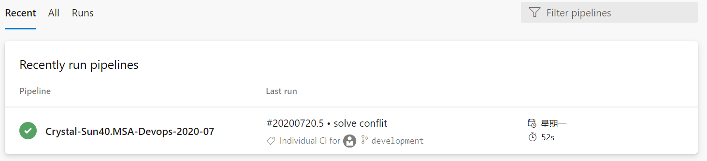
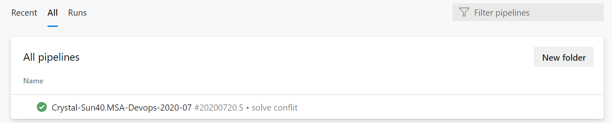
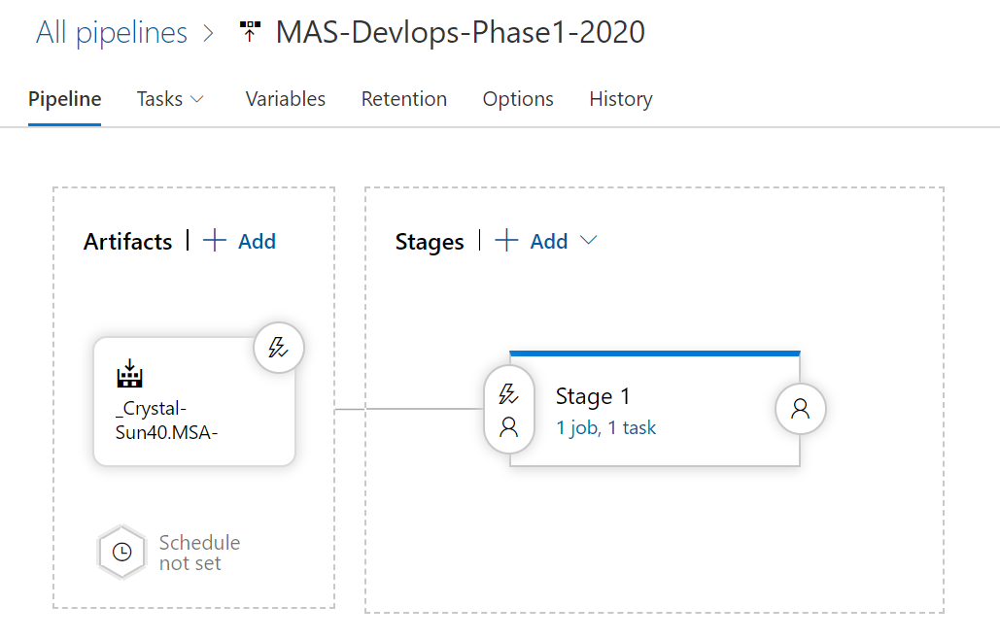
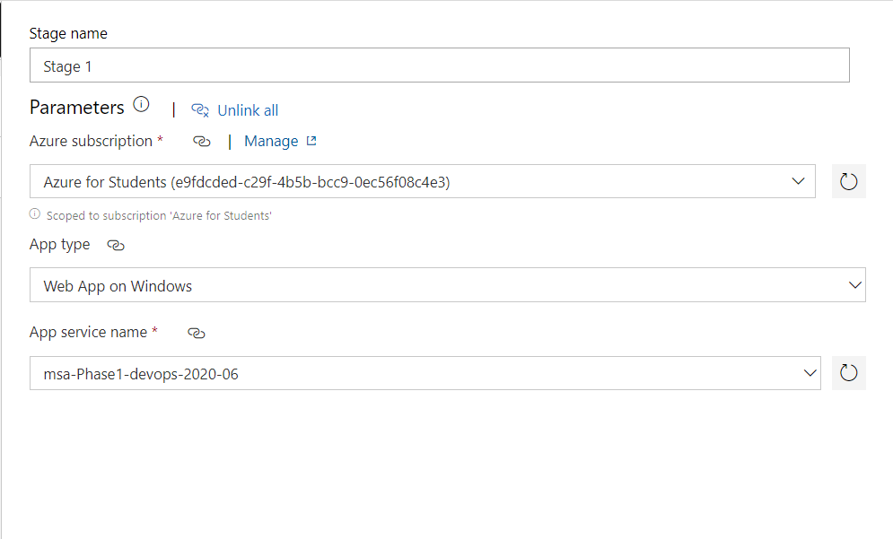
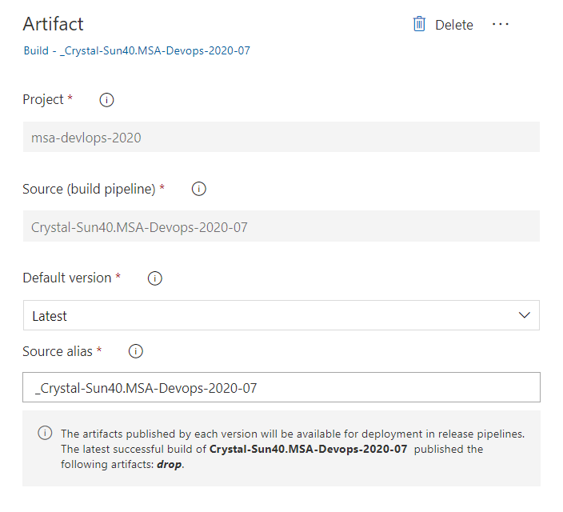
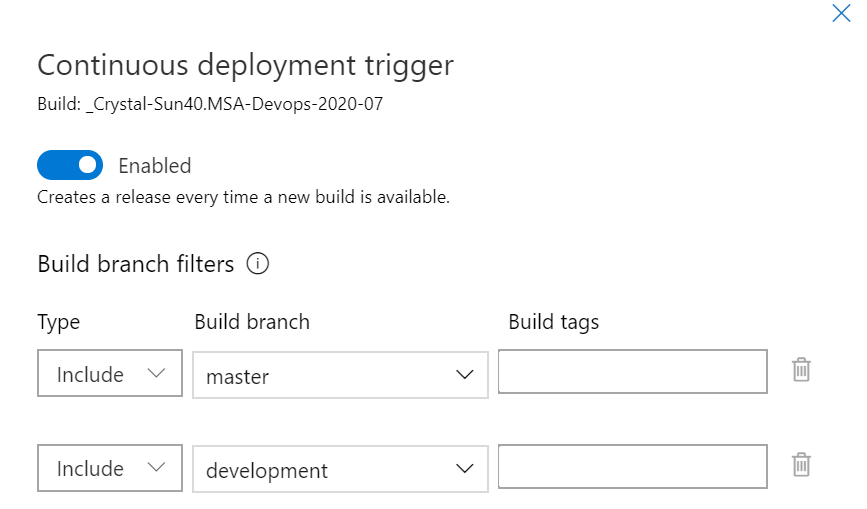

# MSA-Devops-2020-07 Description
This document is for MSA Phase 1 DevOps assignment.
# Table of contents
1. Website URL
2. Azure build pipeline
3. Azure release pipeline

# 1.Website url

<https://msa-phase1-devops-2020-06.azurewebsites.net>

# 2.Azure build pipeline

## 2.1 The location that I build the pipeline:





## 2.2 Azure build pipeline Details Overview

### 2.2.1 Yaml File Overview

```yaml
# Starter pipeline
# Start with a minimal pipeline that you can customize to build and deploy your code.
# Add steps that build, run tests, deploy, and more:
# https://aka.ms/yaml

trigger:
- master
- development

pool:
  vmImage: 'ubuntu-latest'

variables: 
  rootDir: 'my-app'
  buildDir: '$(rootDir)/build'
  
steps:
  - task: NodeTool@0
    inputs:
      versionSpec: '10.x'
    displayName: 'Install Node.js'
  
  - script: |
      cd $(rootDir)
      npm install
      npm run build
      cd ..
    displayName: 'npm install and build'
  
  - task: ArchiveFiles@2
    inputs:
      rootFolderOrFile: '$(buildDir)'
      includeRootFolder: false
      archiveType: 'zip'
      archiveFile: '$(Build.ArtifactStagingDirectory)/$(Build.BuildId).zip'
      replaceExistingArchive: true

  - task: PublishBuildArtifacts@1
    inputs:
      PathtoPublish: '$(Build.ArtifactStagingDirectory)'
      ArtifactName: 'drop'
      publishLocation: 'Container'
```
### 2.2.2 Details:

#### Trigger:

pipeline is triggered by any branch that fits this description. In my case, it will trigger by master branch and development branch. If there any commit changes in two branches, then it will trigger the pipline.

```yaml
trigger:
- master
- development
```

#### Variables:

Here the rootDir variable contains the string 'my-app' and the buildDir variable contains the string 'my-app/build'. 

There are two variables we declared, and they will be used in the comming part.
```yaml
variables: 
  rootDir: 'my-app'
  buildDir: '$(rootDir)/build'
```
#### Steps--Install Node.js and build App：

In this case, I use Node.js version 10.x, and use npm to install the Node. I use the variables which declared in the last part. In pipline, the syntax $(VARIABLE_NAME) is to access the the variables. 
```yaml
  - task: NodeTool@0
    inputs:
      versionSpec: '10.x'
    displayName: 'Install Node.js'
  
  - script: |
      cd $(rootDir)
      npm install
      npm run build
      cd ..
    displayName: 'npm install and build'
```
#### Achieve and Publish

Now zip it and published as artifacts. The $(buildDir) folder contains the build, so it will set as the root folder.  
```yaml
task: ArchiveFiles@2
    inputs:
      rootFolderOrFile: '$(buildDir)'
      includeRootFolder: false
      archiveType: 'zip'
      archiveFile: '$(Build.ArtifactStagingDirectory)/$(Build.BuildId).zip'
      replaceExistingArchive: true

  - task: PublishBuildArtifacts@1
    inputs:
      PathtoPublish: '$(Build.ArtifactStagingDirectory)'
      ArtifactName: 'drop'
      publishLocation: 'Container'

```
# 3. Azure release pipeline

## 3.1 Overview

Release Overview is showing as follow:



## 3.2 Task--Development

We set the release as  continuous deployment trigger.



## 3.3 Artifact

Release artiface is showing as following:



## 3.4 Trigger:

Release trigger setting is showing as following.If there has any new completion comming up from master and development branch, then it will trigger release pipline automatically.




